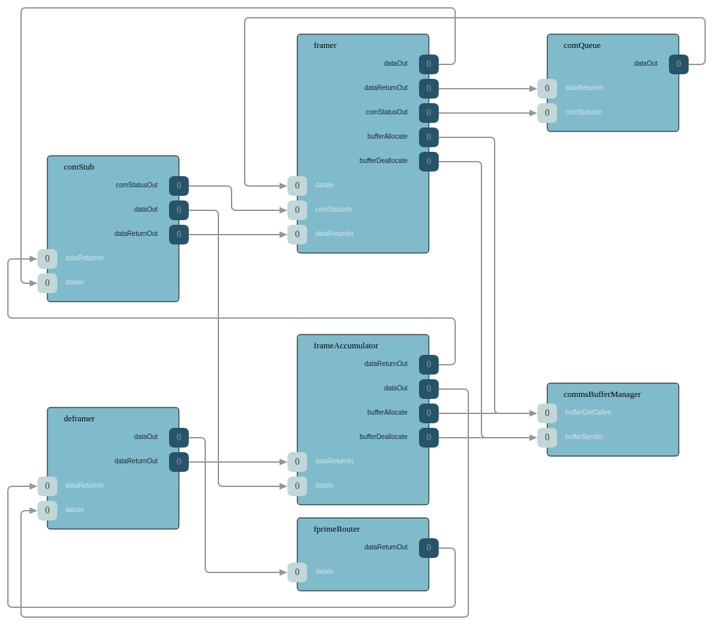

# Communication Stack Functionality

## References

- [F Prime Protocol SDD](https://github.com/nasa/fprime/blob/devel/Svc/FprimeProtocol/docs/sdd.md)
- [F Prime Framer SDD](https://github.com/nasa/fprime/blob/devel/Svc/FprimeFramer/docs/sdd.md)
- [F Prime Deframer SDD](https://github.com/nasa/fprime/blob/devel/Svc/FprimeDeframer/docs/sdd.md)
- [F Prime Router SDD](https://github.com/nasa/fprime/blob/devel/Svc/FprimeRouter/docs/sdd.md)
- [F Prime FrameAccumulator SDD](https://github.com/nasa/fprime/blob/devel/Svc/FrameAccumulator/docs/sdd.md)
- [F Prime ComQueue SDD](https://github.com/nasa/fprime/blob/devel/Svc/ComQueue/docs/sdd.md)
- [F Prime ComStub SDD](https://github.com/nasa/fprime/blob/devel/Svc/ComStub/docs/sdd.md)
- [F Prime ComRetry SDD](https://github.com/nasa/fprime/blob/devel/Svc/ComRetry/docs/sdd.md)
- [F Prime ComSplitter](https://github.com/nasa/fprime/blob/devel/Svc/ComSplitter/ComSplitter.fpp)
- [F Prime ComAggregator SDD](https://github.com/nasa/fprime/blob/devel/Svc/ComAggregator/docs/sdd.md)
- [F Prime ComLogger](https://github.com/nasa/fprime/blob/devel/Svc/ComLogger/README.md)
- [F Prime CmdSplitter SDD](https://github.com/nasa/fprime/blob/devel/Svc/CmdSplitter/docs/sdd.md)
- [F Prime PassThroughRouter SDD](https://github.com/nasa/fprime/blob/devel/Svc/PassThroughRouter/docs/sdd.md)
- [Communication Adapter Interface](https://github.com/nasa/fprime/blob/devel/docs/reference/communication-adapter-interface.md)

## Overview

The communication stack provides the data path between the flight software and external systems (ground station, other processors, or other deployments). It handles outgoing data (downlink) by queuing, framing, and transmitting packets, and incoming data (uplink) by accumulating byte streams, extracting frames, and routing packets to their destination components. The stack is modular and composed from interchangeable components that implement defined interfaces, allowing different protocol layers to be swapped in depending on mission requirements.

### Communication Stack Topology

The following diagram shows the F Prime communication stack using the ComFprime subtopology:

### Downlink Path

Outgoing data flows through the following stages:

1. **Queuing** — [ComQueue](https://github.com/nasa/fprime/blob/devel/Svc/ComQueue/docs/sdd.md) receives data from multiple sources (telemetry, events, file packets) and prioritizes them for transmission. The queue supports configurable depth and priority levels, sending the highest-priority data first. Flow control is managed through a ready signal from downstream components — the queue only sends the next item when the downstream path signals readiness.

2. **Framing** — The framer (e.g. [FprimeFramer](https://github.com/nasa/fprime/blob/devel/Svc/FprimeFramer/docs/sdd.md) or a CCSDS framer) wraps each outgoing packet in a protocol-specific frame. The framing interface is pluggable, allowing different protocols to be selected per mission.

3. **Transmission** — The framed data is passed to a communication adapter that implements the [Communication Adapter Interface](https://github.com/nasa/fprime/blob/devel/docs/reference/communication-adapter-interface.md) for physical transmission. For ground testing, [ComStub](https://github.com/nasa/fprime/blob/devel/Svc/ComStub/docs/sdd.md) wraps a byte stream driver to present this interface. For flight, missions replace ComStub with a mission-specific adapter (e.g. a radio driver) of the same interface. The adapter reports success or failure back through the communication status protocol.

### Uplink Path

Incoming data flows through the following stages:

1. **Accumulation** — [FrameAccumulator](https://github.com/nasa/fprime/blob/devel/Svc/FrameAccumulator/docs/sdd.md) receives a stream of byte buffers from the communication adapter and extracts complete frames.

2. **Deframing** — The deframer (e.g. [FprimeDeframer](https://github.com/nasa/fprime/blob/devel/Svc/FprimeDeframer/docs/sdd.md) or a CCSDS deframer) validates the frame (checking CRC and structure) and extracts the payload.

3. **Routing** — [FprimeRouter](https://github.com/nasa/fprime/blob/devel/Svc/FprimeRouter/docs/sdd.md) (or [PassThroughRouter](https://github.com/nasa/fprime/blob/devel/Svc/PassThroughRouter/docs/sdd.md)) examines the extracted packet and forwards it to the appropriate destination. Command packets are sent to the command dispatcher and file packets are sent to file uplink.

### F Prime Protocol

The F Prime protocol is a minimal framing protocol consisting of four fields:

1. Start word — identifies the beginning of a frame
2. Packet size — the size of the enclosed payload
3. Payload data — the enclosed packet
4. CRC hash — integrity check covering the entire frame

This protocol is designed for simplicity and is commonly used for development and testing with the F Prime GDS. Missions select the appropriate protocol (F Prime, CCSDS, or custom) based on their communication requirements.

### Retry Mechanism

[ComRetry](https://github.com/nasa/fprime/blob/devel/Svc/ComRetry/docs/sdd.md) sits in the downlink path before the communication adapter and resends failed transmissions up to a configurable maximum number of retries. After all retries are exhausted, it propagates the failure upstream. This provides resilience against transient communication failures.

### Communication Logging

[ComLogger](https://github.com/nasa/fprime/blob/devel/Svc/ComLogger/README.md) records all outgoing data to files on the file system, providing a record of transmitted data for debugging and analysis. Log files are rotated based on a configurable size or byte limit.

### Splitting and Aggregation

- [CmdSplitter](https://github.com/nasa/fprime/blob/devel/Svc/CmdSplitter/docs/sdd.md) — Duplicates incoming command buffers to multiple outputs, enabling redundant command processing paths.
- [ComSplitter](https://github.com/nasa/fprime/blob/devel/Svc/ComSplitter/ComSplitter.fpp) — Distributes outgoing communication buffers to multiple output ports.
- [ComAggregator](https://github.com/nasa/fprime/blob/devel/Svc/ComAggregator/docs/sdd.md) — Merges data from multiple input sources into a single output stream.

### CCSDS Protocol Support

For missions requiring standards-compliant space communication, the F Prime and CCSDS protocol components can be swapped in the communication stack. CCSDS components provide Space Packet framing, TM/TC Space Data Link framing, and AOS framing at various protocol layers. See the [CCSDS Protocol Functionality](ccsds-protocol.md) document for details.

### Off Nominal

- Frame validation failures (bad CRC, malformed frames) cause the frame to be dropped with a warning event.
- Queue overflow causes data to be dropped according to the queue's configured overflow behavior.
- Communication adapter failures are reported upstream, and the retry mechanism (if present) attempts retransmission.
- If the communication path is down, the communication queue will fill and begin dropping lower-priority data.
