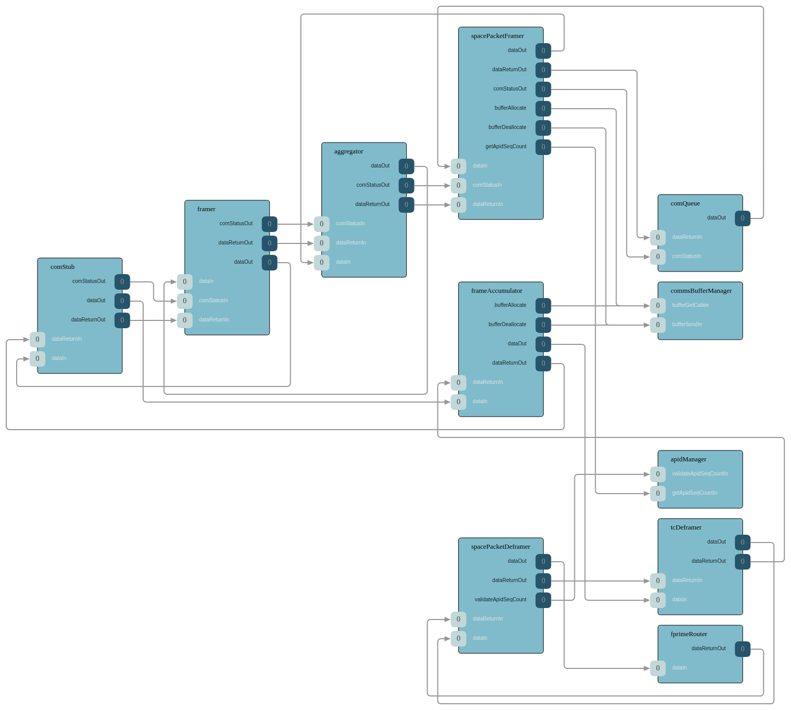
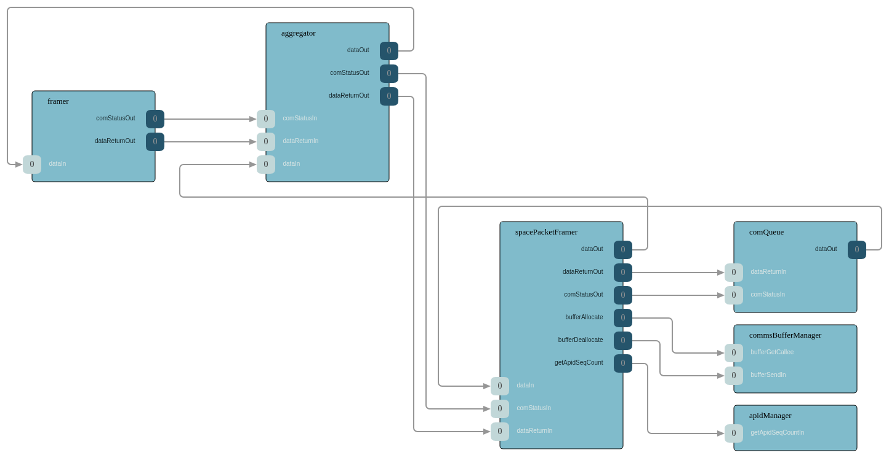
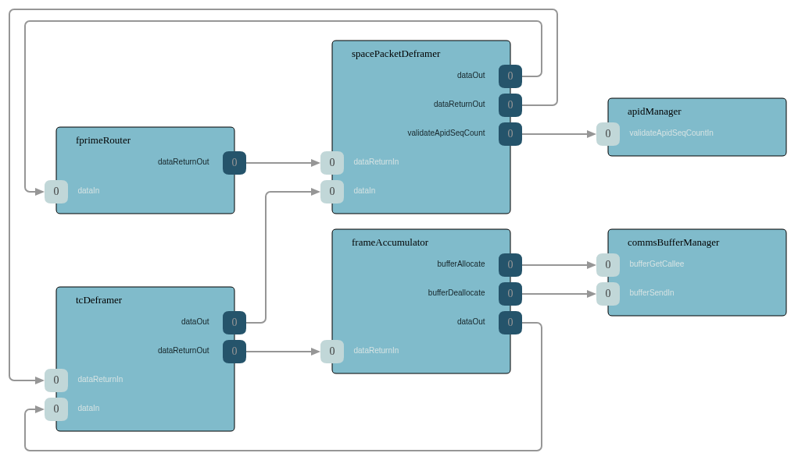

# ComCcsds Subtopology

## References

- [ComCcsds Subtopology SDD](https://github.com/nasa/fprime/blob/devel/Svc/Subtopologies/ComCcsds/docs/sdd.md)
- [F Prime SpacePacketFramer SDD](https://github.com/nasa/fprime/blob/devel/Svc/Ccsds/SpacePacketFramer/docs/sdd.md)
- [F Prime SpacePacketDeframer SDD](https://github.com/nasa/fprime/blob/devel/Svc/Ccsds/SpacePacketDeframer/docs/sdd.md)
- [F Prime TmFramer SDD](https://github.com/nasa/fprime/blob/devel/Svc/Ccsds/TmFramer/docs/sdd.md)
- [F Prime TcDeframer SDD](https://github.com/nasa/fprime/blob/devel/Svc/Ccsds/TcDeframer/docs/sdd.md)
- [F Prime ComQueue SDD](https://github.com/nasa/fprime/blob/devel/Svc/ComQueue/docs/sdd.md)

## Overview

The ComCcsds subtopology packages a CCSDS-standard communication stack as a reusable building block. It provides the complete data path for downlink (framing outgoing data into CCSDS Space Packets and TM Transfer Frames) and uplink (deframing incoming TC Transfer Frames and Space Packets and routing the contents to their destinations). This subtopology is appropriate for missions that require CCSDS-compliant space data link protocols.

Two variants are available, mirroring the ComFprime subtopology design:

1. **With ComStub** — Includes a ComStub adapter for connection to a byte stream driver.
2. **With External ComInterface** — The deployment provides its own communication adapter, typically used for custom radio implementations.

### Topology Diagram

The following diagram shows the complete ComCcsds subtopology:

### Downlink Path

Outgoing data follows a two-stage framing process:

1. The Communication Queue sends data to the Space Packet Framer, which constructs CCSDS Space Packets with proper APIDs and sequence counts.
2. The TM Framer wraps each Space Packet into a CCSDS TM Transfer Frame for transmission over the space link.

### Uplink Path

Incoming data follows a two-stage deframing process:

1. The Frame Accumulator collects bytes and assembles complete frames. The TC Deframer extracts Space Packets from TC Transfer Frames.
2. The Space Packet Deframer validates the Space Packets and extracts the payload, which is then routed by the F Prime Router to its destination (command dispatcher, file uplink, etc.).

### Included Components

- **Space Packet Framer / Deframer** — CCSDS Space Packet Protocol layer
- **TM Framer** — CCSDS TM Transfer Frame construction for downlink
- **TC Deframer** — CCSDS TC Transfer Frame extraction for uplink
- **F Prime Router** — Routes deframed packets to their destinations
- **Communication Queue** — Queues and prioritizes outgoing data
- **Frame Accumulator** — Assembles complete frames from byte stream input
- **ComStub** (variant A only) — Byte stream driver adapter

### Configuration

- Base IDs, queue sizes, stack sizes, and priorities via ComCcsdsConfig.
- CCSDS-specific parameters (APIDs, virtual channels) are configured through the protocol components.

### Required Inputs

- A rate group connection to drive the Communication Queue.
- A byte stream driver (variant A) or custom ComInterface (variant B).
- Telemetry, event, and file downlink sources connected to the Communication Queue.
- Router outputs connected to the command dispatcher and file uplink.
