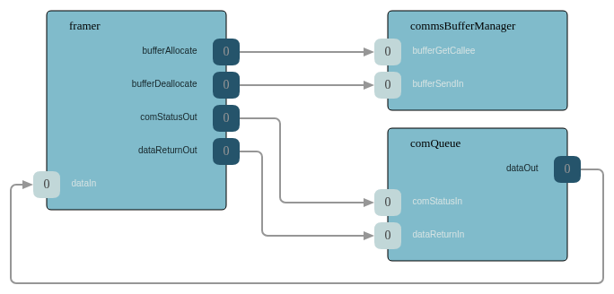
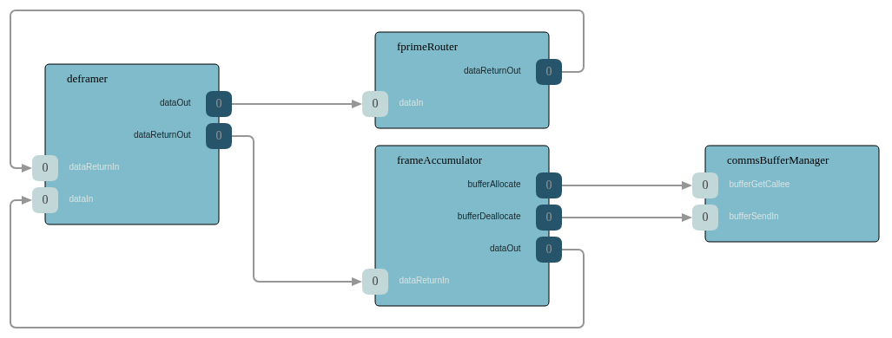

# ComFprime Subtopology

## References

- [ComFprime Subtopology SDD](https://github.com/nasa/fprime/blob/devel/Svc/Subtopologies/ComFprime/docs/sdd.md)
- [F Prime Protocol SDD](https://github.com/nasa/fprime/blob/devel/Svc/FprimeProtocol/docs/sdd.md)
- [F Prime Framer SDD](https://github.com/nasa/fprime/blob/devel/Svc/FprimeFramer/docs/sdd.md)
- [F Prime Deframer SDD](https://github.com/nasa/fprime/blob/devel/Svc/FprimeDeframer/docs/sdd.md)
- [F Prime Router SDD](https://github.com/nasa/fprime/blob/devel/Svc/FprimeRouter/docs/sdd.md)
- [F Prime ComQueue SDD](https://github.com/nasa/fprime/blob/devel/Svc/ComQueue/docs/sdd.md)

## Overview

The ComFprime subtopology packages the F Prime protocol communication stack as a reusable building block. It provides the complete data path for downlink (framing outgoing packets) and uplink (deframing incoming data and routing packets to their destinations). This subtopology uses the lightweight F Prime framing protocol, which is suitable for development, testing, and missions that do not require CCSDS-standard framing.

Two variants are available:

1. **With ComStub** — Includes a ComStub communication adapter and expects to be connected to a byte stream driver (TCP, UDP, UART). This is the simplest option for most deployments.
2. **With External ComInterface** — Does not include a communication adapter; the deployment provides its own implementation (e.g., a radio driver). This variant is used when the communication hardware requires a custom adapter.

### Topology Diagram

#### Downlink Path

#### Uplink Path

### Included Components

- **F Prime Framer** — Frames outgoing packets using the F Prime protocol (start word, size, payload, CRC).
- **F Prime Deframer** — Validates and extracts payloads from incoming F Prime protocol frames.
- **F Prime Router** — Routes deframed packets to their destination (commands to the command dispatcher, file packets to file uplink).
- **Communication Queue** — Queues outgoing data (telemetry, events, file packets) and sends it to the framer. Supports priority-based ordering.
- **Frame Accumulator** — Collects incoming byte stream data and assembles complete frames for the deframer.
- **Buffer Manager** — Provides buffer allocation for the communication path.
- **ComStub** (variant A only) — Adapts a byte stream driver to the communication interface.

### Configuration

- Base IDs, queue sizes, stack sizes, and priorities are configurable via ComFprimeConfig.
- The Communication Queue depth and priority levels are configurable.

### Required Inputs

- A rate group connection to drive the Communication Queue's send cycle.
- A byte stream driver (variant A) or custom ComInterface implementation (variant B).
- Connections from telemetry, event, and file downlink sources to the Communication Queue.
- Connections from the router's outputs to the command dispatcher and file uplink.
