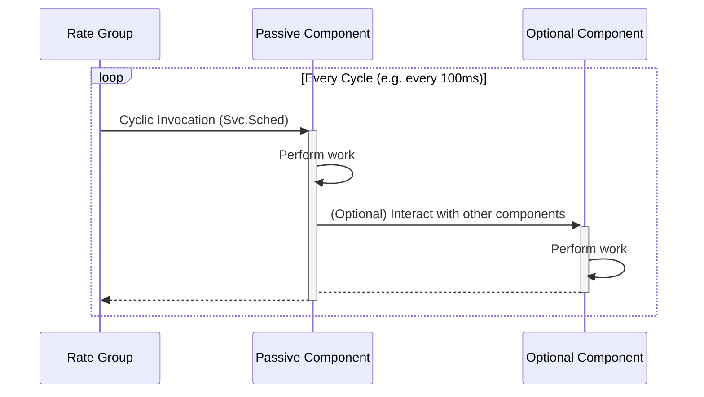
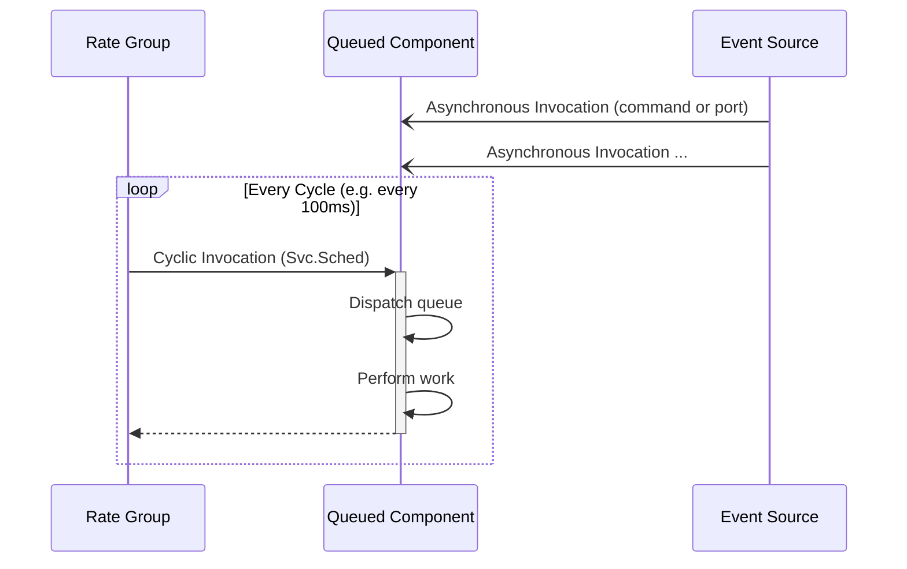
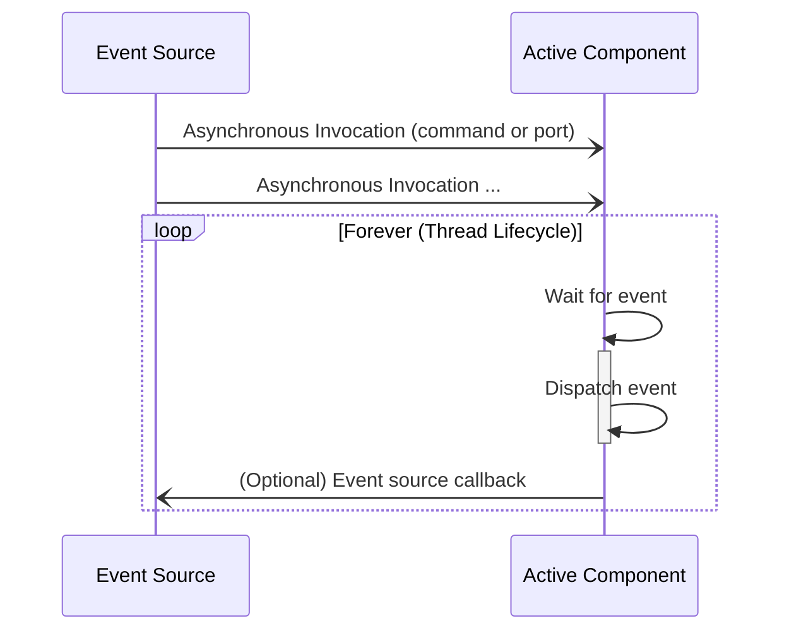
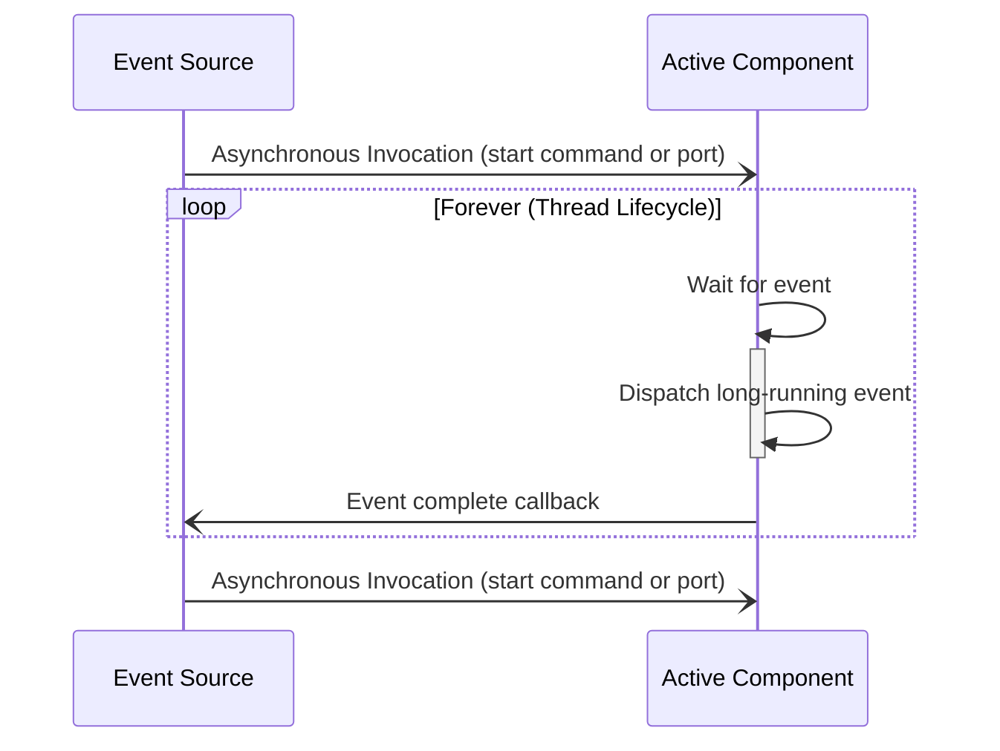
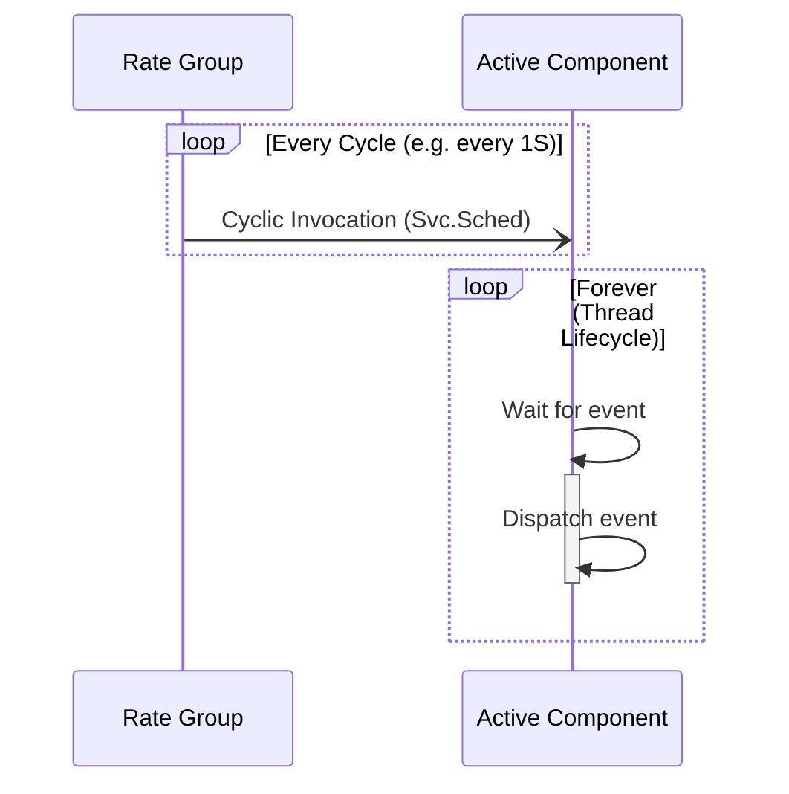
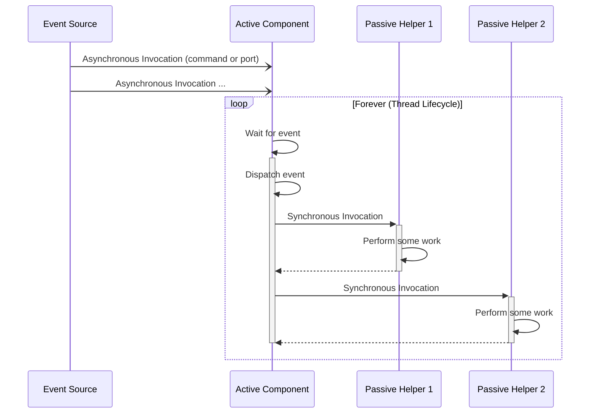
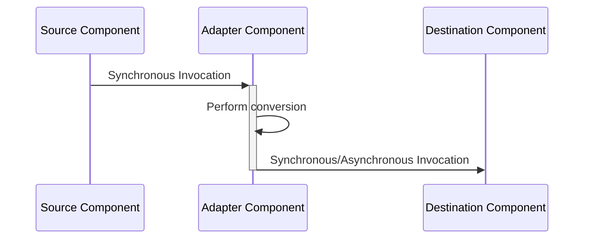

# Selecting Component, Port, and Command Kinds

This document will describe how to select the kind of component, port, and command to use when developing within the F Prime framework. We will focus on the component kinds (passive, queued, and active) and the critical port kinds (sync, async). We will begin by discussing the types of work performed by F Prime systems, then use that model to guide port and component kind selection.

This guide assumes you have a basic understanding of the different component and port kinds. If you are unfamiliar with these concepts, please see [Core Constructs: Ports, Components, and Topologies](../overview/03-port-comp-top.md) for an introduction to these concepts.

> [!NOTE]
> This document does not discuss output ports as the kind of port is determined on the input side of the connection.

> [!IMPORTANT]
> Commands are implemented in F Prime via ports. Thus they have the same kinds (`async`, `sync`, and `guarded`) and for the purposes of this document, they follow the same decision process as ports.

**Table of Contents**
- [Types of Work in F Prime Systems](#types-of-work-in-f-prime-systems)
- [Component Selection for Cyclic Work](#component-selection-for-cyclic-work)
  - [Passive Components for Cyclic Work](#passive-components-for-cyclic-work)
  - [Queued Components for Cyclic Work](#queued-components-for-cyclic-work)
- [Event-Driven Work](#event-driven-work)
- [Background Work](#background-work)
- [Hybrid Patterns](#hybrid-patterns)
  - [Cyclic Notification Pattern](#cyclic-notification-pattern)
  - [Active Anchor Pattern](#active-anchor-pattern)
  - [Passive Converter Pattern](#passive-converter-pattern)
- [Conclusion](#conclusion)

## Types of Work in F Prime Systems

Work in an F Prime system breaks down into three categories roughly driven by the timing requirements of the work.  These are:

1. Cyclic Work: Cyclic work is how F Prime addresses hard deadlines. This work is performed on a repeating schedule driven by a [Rate Group](../design-patterns/rate-group.md). e.g. send a control update every 10ms.
2. Event-Driven Work: Event-driven work is how F Prime addresses timely work lacking hard deadlines. e.g. dispatch commands reasonably quickly.
3. Background Work: Background work is how F Prime addresses work without timing requirements. e.g. log telemetry to disk.

Two other relevant terms are synchronous and asynchronous invocations (i.e. how a port executes).  Synchronous invocations happen immediately and block the caller until completion just like a typical function call. Asynchronous invocations are queued up until some point in the future when the receiver processes them. Synchronous ports are invoked synchronously and asynchronous ports are invoked asynchronously and backed by a queue in the receiver component.

> [!IMPORTANT]
> Cyclic work is almost always performed via synchronous invocations while Event-Driven and Background work is typically performed via asynchronous invocations.

Understanding the type of work your component will perform is the first step to selecting the appropriate component and port kinds. We will discuss component selection for each type of work.

## Component Selection for Cyclic Work

When performing cyclic work, it is crucial to know whether all work in the cycle will complete before the cycle repeats, because this 'slip' indicates a failure to meet the cycle’s hard deadline. For example, a 10 Hz control update must happen every 100 ms. If one iteration takes longer than 100 ms, the cycle has slipped and system control has been compromised because it did not keep up with the expected control rate. For this reason, cyclic work is almost always performed via synchronous invocations and therefore uses a sync port. Asynchronous invocations are not used because this work would be run outside the rate group cycling context and thus slips and failure to reach deadlines would be hidden in another thread.

> [!CAUTION]
> Remember, `guarded` ports are also synchronous with an internal mutex to protect data.  These are not as common in cyclic work and a full discussion of `guarded` ports is outside the scope of this document.

Since the primary mode of invocation is synchronous when doing cyclic work, we will choose a component kind that primarily handles synchronous invocations, i.e., a `passive` or `queued` component.

### Passive Components for Cyclic Work

Passive components are the natural choice for cyclic work as we intend them to execute in the context of the invoking rate group. A good starting model for cyclic work is to have a passive component with a `sync` port of type `Svc.Sched` that performs the repeating work for that component each cycle.

You may add output ports as needed for the component to interact with other components, but the primary work of the component will be performed in the `Sched` handler.  This is a simple and common model for cyclic work.

A timing diagram of this model is shown below.

**Figure 1**: a rate group driven passive component that may call another component as part of its cyclic execution.

> [!CAUTION]
> This simple `passive` pattern breaks down when the cyclic component needs to accept some Event-Driven work (e.g. it processes some commands). This use case is described in the next section.

### Queued Components for Cyclic Work

When a component performing cyclic work also needs to accept some Event-Driven work, we require a queue to handle the asynchronous invocations, but adding a queue processing thread may disrupt the critical synchronous invocations of the core cyclic work of the component.  For this exact reason, we use a `queued` component. A `queued` component allows asynchronous events to be accepted while keeping a synchronous core.  In this model, the component dispatches the queue as part of the primary synchronous invocation (i.e. `Svc.Sched` handler) thereby moving the asynchronous work into the cycle.

We do not typically used `sync` commands in this context because a synchronous command would block the command dispatch while executing, and also requires mutex protection to access shared data. These mutex accesses can disrupt the critical cyclic work by occurring at anytime whereas the queue is processed at a specific point in the cycle.

Adding a thread to handle the asynchronous work would either mean the cyclic work is moved to this thread (again hiding slips and failures to meet deadlines) or the component thread and rate group thread would need concurrency protection that causes disruption.

> [!IMPORTANT]
> In most situations, you want a singular thread to execution to do all the work of the component. If a rate group is driving the component, use a queue to pull asynchronous work into that thread. If you have a Event-Driven components (see below) then all interaction should be `async` as to be performed on the component's thread.

**Figure 2**: a rate group driven queued component that dispatches asynchronous events as part of its cyclic execution.

> [!IMPORTANT]
> In this model, it is **imperative** that you dispatch the queue in some synchronous implementation (i.e. the `Svc.Sched` handler); otherwise, the queue will fill but events will never process.

## Event-Driven Work

Since Event-Driven work is typically high-priority but without strict hard deadlines, this work is typically done via asynchronous invocations and uses the `async` port kind.  Since the component lacks another context to run in, we use an `active` component to dispatch the asynchronous work.

This model is constructed by having any number of `async` ports and commands attached to an `active` component. The thread scheduler handles the rest.

Synchronous Event-Drive work is typically avoided because that work would block the source of the event while it is processed. This causes unnecessary coupling between components leading to more complicated system design. Thus Event-Drive work is typically performed asynchronously.  We use an `active` component because it has its own thread to processes asynchronous work.

> [!IMPORTANT]
> Here again we see uniformity in our invocations. In an `active` Event-Driven component, all ports and commands are typically `async` to that they all process on the same thread. Other patterns require concurrency protection, which is more complicated and can couple components' executions together.

**Figure 3**: an active component that dispatches asynchronous events as part of its thread lifecycle.

## Background Work

In F Prime, background work is typically performed via asynchronous invocations and thus uses the `async` port kind.  Since the component lacks another context to run in, we use an `active` component to dispatch the asynchronous work via a thread.

This model is identical to the Event-Driven work model running at a lower thread priority, thus requiring more careful queue management. The event source for background work should emit only a small number of events until the background work is indicated as complete ([see the port callback pattern](../design-patterns/common-port-patterns.md#callback-ports) for more details on how to indicate that background work is complete) in order to prevent queue overflows.

**Figure 4**: an active component that dispatches background events as part of its thread lifecycle. Here a callback indicates the background work is complete and another event can be handled.

> [!IMPORTANT]
> Components performing background work should be engineered to accept only a small number of events at a time to prevent queue overflows. An example is the [Manager/Worker pattern](../design-patterns/manager-worker.md).

## Hybrid Patterns

Sometimes component design does not neatly fit into the above categories. This section will elaborate on some common "hybrid" patterns that combine the above models.

> [!CAUTION]
> This section is intended to give developers a deeper understanding of real-world designs. You should prefer the simpler models above wherever possible.

### Cyclic Notification Pattern

We discussed what happens when a cyclic component needs to accept the occasional Event-Driven work, but what if a primarily Event-Driven component needs to perform the occasional cyclic work? For example, a component needs to emit telemetry at a regular interval that is not a strict deadline.

In this case, we can use the "Cyclic Notification Pattern" where an `active` component performs primarily Event-Driven work but also has an `async` port of type `Svc.Sched` that converts the cyclic invocation into a queued event that is processed roughly at the cycle interval.

**Figure 5**: an active component that dispatches events as part of its thread lifecycle. Some events are generated by a cyclic invocation via a `Svc.Sched` port.

### Active Anchor Pattern

Sometimes the work done by an Event-Driven component is easier to decompose into multiple components. In this case, there is typically an Event-Driven active component that orchestrates a set of passive helper components as part of its handling of events.

**Figure 6**: an active component that dispatches events as part of its thread lifecycle using a series of passive helper components for a more nuanced decomposition.

### Passive Adapter Pattern

Sometimes you just need a component that does some menial conversion or other work as part of what is logically another port call. For example, you need to connect two components with incompatible port types and need to reconcile those types. In this case, you can use a passive component as an adapter that is called synchronously as part of the primary port call.

**Figure 7**: a passive adapter component that performs a conversion inline with a port call.

## Conclusion

This document covers the basics of component and port kind selection in F Prime. It should give you a starting point for making informed decisions when developing F Prime components.  However, there are always times where a real design may depart from these models. The important thing is to understand why and be able to justify it.

The following table maps the key patterns in this document to concrete examples in the F Prime codebase.

| Pattern | Typical Shape | Example Components/Subtopologies |
| --- | --- | --- |
| Passive Components for Cyclic Work | `passive` component with `sync` `Svc.Sched` input | N/A* |
| Queued Components for Cyclic Work | `queued` component with `sync` schedule input and async/event inputs | `Svc.Health` |
| Event-Driven Work | `active` component with primarily `async` command/port inputs | `Svc.EventManager` |
| Background Work | `active` component handling non-deadline work asynchronously | `Svc.FileWorker` |
| Cyclic Notification Pattern | `active` component with an `async` `Svc.Sched` input used as periodic notification | `Svc.TlmPacketizer` |
| Active Anchor Pattern | One active "anchor" plus passive helper components | `ComCcsds.FramingSubtopology` (`Svc.ComQueue` with passive helpers like `Svc.Ccsds.TmFramer`) |
| Passive Adapter Pattern | `passive` adapter/converter called inline with existing flow | `Drv.ByteStreamBufferAdapter` |

> [!NOTE]
> * The core F Prime codebase does not deal with any hard deadlines and thus does not have a canonical example of a purely cyclic component.