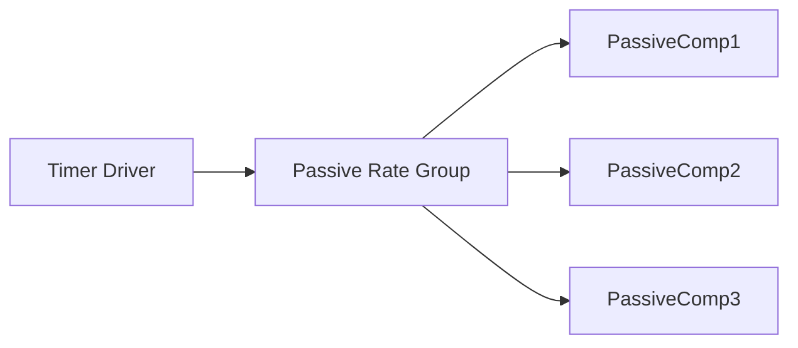

# F´ on Baremetal Systems

The baremetal pattern enables F´ applications to run on processors without an operating system. This pattern is designed for resource-constrained environments where traditional OS features like threads and message queues are unavailable.

## What is Baremetal?

"Baremetal" is defined as a processor/application that does not run with an operating system. In baremetal environments:

- There is no software provided to run processes or threads
- Resources are usually constrained (RAM, storage)
- There is one point of entry: a single `main()` function that typically runs a continuous control loop (e.g., `while(true) { ... }`) from which all execution flows
- Interrupt service routines (ISRs) can be used

## F´ and Baremetal

F´ does not require an operating system. Applications can be written entirely as a set of passive components with one Timer component driving the entire application through passive rate groups. However, using many of the standard F´ `active` components requires a Task abstraction, as provided by the operating system abstraction layer (OSAL).

The baremetal pattern provides a solution that allows F´ core components to be used in baremetal deployments while adapting to the constraints of the environment. It provides information on how to support baremetal with components written for complete OSAL adaptations.

In a typical baremetal F´ system, a single hardware timer drives the rate groups, through the `Svc.RateGroupDriver` component, at a fixed interval. There is no concurrent scheduling — the system behaves as a sequential queue of work dispatched on each timer tick.

### The Joy of Passive Components

First and foremost, baremetal F´ systems should avoid using **Active Components** where possible. This is because active components own a thread, which means they need OS-level threading support to execute concurrently — something unavailable on baremetal. This means using `passive` or `queued` components driven by rate groups or cycled on the main thread.

To understand the tradeoffs between `active` components and `passive`/`queued`, as well as design patterns that may allow you to migrate from one type to another, you may refer to the document on [Selecting Component, Port, and Command Kinds](./component-and-port-selection.md).

> [!NOTE]
> If you **must** use **Active Components**, first consider using an RTOS instead of baremetal. Thread virtualization (described [below](#thread-virtualization)) is intended as a stepping stone for developers as they either migrate to a full RTOS or replace active components with `queued` equivalents.

If your system can be entirely defined by `passive` and `queued` components then implicitly every port **invocation** would be eventually run in a synchronous call and the execution context would be entirely delegated to every component. Thus the need for a thread scheduler would disappear. A discussion of the source of that delegated execution context comes next.

### Architecture

In a baremetal F´ application, components are organized around a passive rate group pattern:



The timer driver invokes the passive rate group at a fixed rate, which then drives the execution of all connected components. Since there are no threads or queues, all components use sync ports and execute synchronously when called.

> [!TIP]
> Typically in baremetal systems `queued` component messages are dispatched via a rate-group with a bounded maximum of message dispatches per invocation.

## Baremetal Features

F´ provides support for baremetal deployments through the [fprime-community/fprime-baremetal](https://github.com/fprime-community/fprime-baremetal) support package, which ships as an F´ library. This package provides passive component implementations and other features described below.

### Baremetal OS

The Os/Baremetal module provides an implementation of the OS abstraction layer (OSAL) to emulate threads, message queues, and other OS features. This allows the use of F´ core components that depend on OS abstractions without requiring a full operating system.

Key characteristics:

- Emulates OS features like threads
- Provides compatibility with the F´ OSAL model

> [!CAUTION]
> Users requiring thread emulation should read [Thread Virtualization](#thread-virtualization) for an experimental approach using protothreading.

**Baremetal vs. RTOS:** Running F´ on baremetal gives developers full control over timing and eliminates OS overhead, which is ideal for tightly resource-constrained processors (e.g., small microcontrollers with limited RAM). However, a full RTOS provides robust scheduling, task management, and synchronization, which simplify the development of systems with complex timing requirements or many independent tasks. Choose baremetal when your system can be expressed as a set of passive components driven by rate groups and when minimizing code size and memory footprint is critical. Choose an RTOS when you need preemptive multitasking, priority inversion handling, or when using a large number of active components.

### MicroFs

MicroFs provides an in-memory basic file system for components that need file access. This is primarily useful for components that depend on file-system interfaces, such as those managing data products, parameter storage, or sequence file loading.

- Provides basic file system operations (open, read, write, close)
- Stores files in RAM
- Only persists as long as the processor is powered

For systems with flash storage or other non-volatile memory, developers may choose to provide their own file system implementation or wrap a third-party library (e.g., [LittleFS](https://github.com/littlefs-project/littlefs) or [FatFs](http://elm-chan.org/fsw/ff/)). This is done by implementing the `Os::FileSystem` interface so that F´ components can interact with the custom file system transparently.

## Configuration and Tuning

F´ provides configuration options to optimize for the constrained environments of baremetal deployments. These options are useful to minimize the code size, memory footprint, and other resources.

### F´ Configuration

F´ has numerous configuration options to scale the size of F´ down for resource-constrained environments. These are found in the project's copy of the `default/config` directory. For complete configuration details, see [User Guide: Configuring F´](../framework/configuring-fprime.md).

Example configuration options include the following:

- Toggle features on and off
- Specify buffer and storage sizes
- Adjust maximum string lengths, queue depths, and object name lengths
- Disable components and services not needed in the deployment

See [User Guide: Configuring F´](../framework/configuring-fprime.md) for the full list of options.

### Port Call Optimization

F´ provides alternate code generation for port connections to eliminate some of the abstraction layers, reducing overhead and code size in resource-constrained environments. This is an advanced feature that can be enabled by using the `FW_DIRECT_PORT_CALLS` compile option. Interested projects can investigate on their own, this is all part of the autocoded code in the build cache. As a note, this option may be enabled by default in the future.

## Implementation Suggestions

When implementing a baremetal F´ application, consider the following:

### Component Organization

Develop components based on the [Rate Group pattern](../design-patterns/rate-group.md):

- Have it driven by a hardware timer at the necessary rate
- Use PassiveRateGroup to drive a set of components (including F´ core components)
- All components should use passive ports for reasons discussed above.

### Scale F´ Features

Minimize resource usage by:

- Turning off port serialization if not needed
- Scaling command tables and telemetry storage to minimum size needed
- Adjusting buffer sizes to match actual requirements
- Disabling unused features

### Choose an Execution Context

Ensuring that some call invokes all of the **Components** that compose the F´ system is key to running a baremetal system. Otherwise, some components will not run. Typically, this is handled by composing an F´ baremetal system into components that are all driven by [rate groups](../design-patterns/rate-group.md). Additionally, users could call components from the main thread.

Designing the system this way ensures that all execution is derived from one source: the rate group driver and thus reducing the problem to supplying an execution context to the rate group driver at a set rate. All calls needed will execute during a sweep through the rate groups and their derived rates.

> [!NOTE]
> Other options exist (see [Thread Virtualization](#thread-virtualization) below), however; these methods **still** require a context to run in.

Although a full discussion of supplying execution context to the rate group driver is outside the scope of this
documentation, here are a few tips. i.e. embedded software typically looks like the following and the loop-forever `execute();` action should trigger the rate group driver at a set interval.

```C
// Run once setup
setup();

// Do this forever
while (true) {
   execute(); // Cycle rate groups, and or thread virtualization here.
}
```

Now all that is required is to determine when this interval has elapsed. This can be done by spinning on a hardware clock
signal, calculating elapsed time by the reading of clock registers, using timing library functions, the `sleep()` call, or
by a timer-driven interrupt service routine (ISR).

> [!NOTE]
> ISRs are complex items and should be studied in detail before going this route. Notably, the ISR should not execute the rate group directly, but rather should set a flag or queue a start message and allow the `while (true) {}` spin in the main loop to detect this signal and start the rate groups.

## Thread Virtualization

> [!NOTE]
> This is a specialized technology with respect to F´. Care to understand its implementation should be taken before using it in a production/flight context.

Some systems, even baremetal systems, require the use of **Active Components**. Many of the `Svc` components are by design active components. It is impractical to assume that all projects can, at the moment of conception, discard all use of the framework provided **Active Components**. Thus F´ was augmented with the ability to virtualize threading, such that projects could use these components during development as they migrate to a fully passive-component system.

The standard baremetal pattern uses only passive components. Thread virtualization is an advanced alternative approach when active components are needed.

To activate this feature see: [Configuring F´](../framework/configuring-fprime.md). The following sections describe how the thread virtualization system works internally.

### Defining Custom Tasks

When using the thread virtualization technology, care should be taken with custom tasks/threads. This design, as described below, is dependent on threads that "run once" and externalize the looping part of the thread. Therefore, custom tasks must wrap functions that obey the following implementation requirements:

1. The function shall not loop
2. The function shall never block execution
3. The function shall perform "one slice" of the thread and then return — that is, it should do a small, bounded unit of work and then yield control by returning

This is a form of cooperative scheduling: each function performs a small unit of work and voluntarily yields control by returning, allowing the next function to run. Unlike preemptive threading where the OS can interrupt a thread at any time, cooperative scheduling relies on each task being well-behaved. If any function loops indefinitely or blocks, no other task will get a chance to execute, causing the system to lock up or behave erratically.

> [!TIP]
> The F´ active component implementation already obeys these requirements. Users need to obey these expectations w.r.t user defined threads.

### How It Works

At the core of **Active Components** is a thread, which typically requires an OS to provide a scheduler for it to run, and through this scheduler, it gets designated an execution context to run in. Thus threads can execute as if they fully own their execution context and the OS masks this behind the scenes. The purpose of thread virtualization, when enabled for an F´ project, is to unroll these threads such that they can share a single execution context and the concurrent behavior of the threads is "virtualized". The technique is known as [protothreading](https://en.wikipedia.org/wiki/Protothread). We'll explore this concept with relation to F´ below.

> [!NOTE]
> It is important to distinguish between *true parallelism* (multiple instructions executing simultaneously on separate cores) and *concurrency* (multiple tasks making progress by interleaving execution on a single core). On a single-core baremetal system, true parallelism is not possible. Thread virtualization provides concurrency — each component takes turns executing, creating the appearance of parallel operation.

Each F´ thread supporting an Active component can be roughly modeled by the code below. The thread loops until the system shuts down. For each iteration through the loop it blocks (pauses execution) until a message arrives. It then dispatches the message and returns to a blocked state waiting for the next message.

```C++
Component1 :: run_thread() {
    while (!shutdown) {
        msg = block_get_message();
        dispatch(msg);
    }
}
```

Here `block_get_messages();` retrieves messages, blocking until one arrives. This loop could have easily been implemented using a less-efficient model by iterating continuously through the loop and checking if a message has arrived and dispatching if and only if a message is available. As can be seen below, the wait-by-blocking has been replaced by the busy wait of constantly iterating through the loop.

```C++
void Component1 :: run_once() {
    if (message_count() > 0) {
        msg = nonblock_get_message();
        dispatch(msg);
    }
    return;
}

Component1 :: run_thread() {
    while (!shutdown) {
        comp1.run_once();
    }
}
```

Here, we extracted the iteration into a `run_once` function for clarity. The blocking wait in the first function is replaced with a spin on an if-condition until a message is available, then the dispatch happens.

It should be only a slight extrapolation that one could move all the component `run_once` functions into a single loop and call each in succession. As long as these calls return in a reasonable amount of time, and none of these calls block internally, then concurrency is achieved through cooperative round-robin scheduling.

```C++
while (!shutdown) {
    comp1.run_once();
    comp2.run_once();
    comp3.run_once();
    ...
}
```

Here, as seen above, `run_once` does not block and so each component gets a slice of execution time before yielding to the next. Concurrency has been virtualized — each component takes turns running, and the processor is shared without writing a full-blown thread scheduler or requiring processor instruction set support to switch threading contexts.

Inside F´ a parallel implementation of the active component task was implemented such that it returns rather than blocks on receiving messages. When `BAREMETAL_SCHEDULER` is enabled in the F´ configuration, this alternate implementation is used. Under `Os/Baremetal`, an implementation of a sequential scheduler exists. This scheduler snoops on task registration and will call all thread executions in a loop driven from the main program loop similar to below.

```C++
setup(); // Setup F´
while (true) {
    scheduler.run_once();
}
```

## Conclusion

The baremetal pattern enables F´ to run on resource-constrained processors without an operating system while still allowing the reuse of F´ core components. By using the Baremetal OS abstraction layer, MicroFs for file operations, and careful configuration tuning, developers can deploy F´ applications on microcontrollers like Arduino and STM32 platforms.

## Resources

- [`fprime-baremetal-reference`](https://github.com/fprime-community/fprime-baremetal-reference): a reference implementation of a baremetal F´ application
- [`fprime-baremetal`](https://github.com/fprime-community/fprime-baremetal): a support package for baremetal F´
- [F´ on Multi-Core Systems](./run-multi-core.md): guide for multi-core F´ deployments
- [Protothreading (Wikipedia)](https://en.wikipedia.org/wiki/Protothread): background on the protothreading technique used by thread virtualization
- [Rate Group Pattern](../design-patterns/rate-group.md): the design pattern used to drive component execution in baremetal systems
